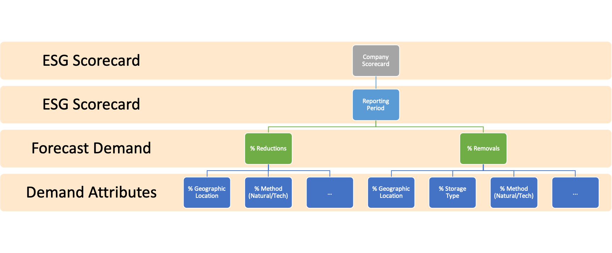
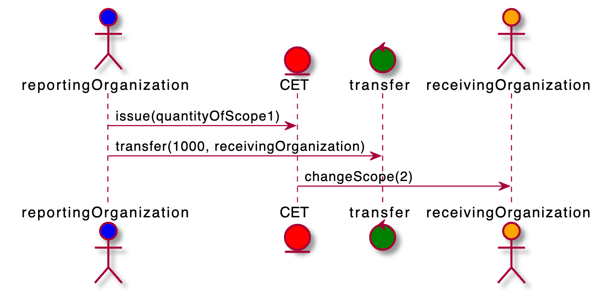
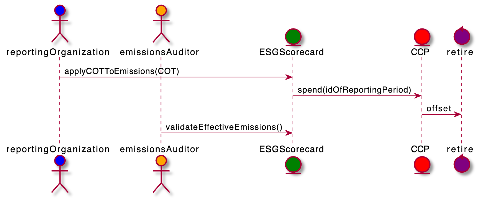

# Voluntary Reporting, Progress Tracking and Demand Signals

The [ESG](https://www.investopedia.com/terms/e/environmental-social-and-governance-esg-criteria.asp) Scorecard is for:

- Buyers looking to offset do so for various reasons, brand protection, valuation/stock price and compliance are a few.
- How to establish Emissions goals and report progress.
- Send demand signals about product preferences
- Actions take are typically reflected up into what corporate investors call ESG (Environmental, Social & Governance) criteria.
- How can those being rated against the criteria provide accurate and trusted (governance) data to evaluators? Concerns over subjective scoring.
- A standard voluntary progress tracker to state goals, record actual emissions and offset against.
  - Emissions reporting – recommendation to start with coarse goals and actual emissions. Structure to allow for more granular reporting to follow as the process matures
  - Offsetting details should come from transactions and provide the granular detail available from standards in supply creation

This contract is a simple, ESG scorecard for a participant to record their established pledge: net zero, net negative, etc. and track progress: goals, forecast, actual, effective. The contract can also include an auditor or registry for different reporting periods. The contract provides the following key capabilities:

- Signal demand and buyer preferences
- Offsets are applied to the scorecard, when retiring the offset.
- Completes the lifecycle of the offset credit.
- Should be able to be private with conditional access
- *In the future it can be used to provide verification for 3rd parties evaluating the participants ESG score and used for more detailed emissions reporting.*

## Properties

The ESG Scorecard contract contains these initial properties and functions:

- Company Name:
- Long Term Pledge: Carbon x by Date (where x is neutral, net 0 or negative)
- Forecast for reporting periods up to Date:
  - Quarter, Year = y mtCO2e emitted
  - Placeholder for Quarter, Year for actual emission entry as demand indicator
- Offsets are spent and applied towards a reporting period, which can be used to calculate effective emissions
- When token is offset towards an ESG Reporting period, the offset request should pass in the Id of the scorecard entry it offsets.

## Demand Signals

To establish a clear demand signal to suppliers, a more detailed forecast for they type of offsetting the buyer will engage in can provide details about removals vs. reductions, then in each offset preference the demand signal can be filtered further via technique - nature vs. technical, storage - biosphere vs. geosphere, geography, etc.

Determining the list of attributes to cover the majority of demand signal preferences may run into limits. It is to be determined whether variables like GWP would be important for buyers, for example:

- Year scale for Global Warming Potential (GWP) for calculating GHG CO2e:
  - 100yr GWP vs. 20yr GWP for methane(CH4) that has greater warming potential in the 20yr vs. 100yr GWP.

## Example ESG Scorecard Contract with Future Emissions Goals

Here an organization creates a new ESG Scorecard Contract publishing their future GHG Emissions goals by a certain date and adding a reporting entry placeholder for each reporting date up to the future emission goal.

For example, if an organization's goal is to be carbon negative by 2030, they would publish that goal for the final quarter of 2029 having a emissions report of -1. Then add an entry for each reporting period (quarterly, bi-annual or annually) recording their goal for that period.

If their current quarterly emissions report is 10,000 and they have 38 reporting periods (quarters) until their goal, they can simply establish their period goal by reducing emissions by 264 for each period to achieve a negative emission goal.

`10,000/38 = ~264` subtract 264 from each period's emission goal.

```plantuml
@startuml
    actor reportingOrganization #blue
    entity ESGScorecard #green
    collections reportingPeriods #orange

    reportingOrganization -> ESGScorecard: createESGScorecard
    reportingOrganization -> ESGScorecard: addReportingPeriods(futureReportingPeriodCollection)
    ESGScorecard -> reportingPeriods: addReportingPeriod(futureReportingPeriod)

@enduml
```

## (FUTURE) Reporting and Allocated Transfer of Emissions

Participants report their emissions using CET (Carbon Emission Tokens) and transfer may transfer ownership of CETs through their supply change which changes their GGP Scope and Category. CETs are issued by GHG sources like power utilities and organizations that emit GHG through their direct operations, CETs are issued as Scope 1.

When a CET is transferred in the supply chain from Scope 1 (direct generation) to another participant, like a power company's consumer, a quantity CETs are transferred to the consumer and set to Scope 2. If the participant's power provider does not issue CETs, the participant can issue CETs directly as Scope 2 emissions. Scope 3 emissions is more difficult to calculate, until the entire supply chain is reporting their Scope 1 & 2 emissions and correctly performing allocated transfers of CET upstream. To accommodate the accounting and calculation of Scope 3 emissions in the meantime, Scope 3 emissions can be recorded in the period report.

```plantuml
@startuml
    actor reportingOrganization #blue
    entity CET #red
    control transfer #green
    actor receivingOrganization #orange

    reportingOrganization ->    CET: issue(quantityOfScope1)
    reportingOrganization -> transfer: transfer(1000, receivingOrganization)
    receivingOrganization <- CET: changeScope(2)

@enduml
```

## Audit Emissions

An emissions reporter will select an auditor for their reporting period and record their emissions 'side by side' with their period goal. The period goal is recorded as a number entry, but actual emissions are reported using CET (Carbon Emission Token) sums for the reporting period.

Because CETs have a lifecycle and transfer in a carbon supply chain between GHG sources to consumers, in the future the same CET will transfer between owners until it reaches its final destination. For example, a power utility company's Scope 1 emissions, become their customer's Scope 2 emissions which can become another organization's Scope 3 emissions in a supply chain. This is covered in more detail in [CET](cet.md).

However, until a critical mass of participants reporting emissions that can be "track and traced" through the supply chain, Scope 3 emissions calculations should be reported using one of several methodologies being developed in the market.

The role of the auditor is to ensure that the issued and owned CETs for the reporting organization matches their audit results, correct any discrepancies and then sign off on the period's report.

```plantuml
@startuml
    actor reportingOrganization #blue
    actor emissionsAuditor #orange
    entity ESGScorecard #green
    control updateReportingPeriod #blue
    entity reportingPeriod #red
    collections reportingPeriods #green

    reportingOrganization ->    ESGScorecard: setEmissionsAuditor(emissionsAuditor)
    emissionsAuditor -> ESGScorecard: validatePeriodReport(reportingPeriod)
    ESGScorecard -> updateReportingPeriod: update(reportingPeriod)
    updateReportingPeriod -> reportingPeriods: update(reportingPeriod)
@enduml
```

## Offsetting Emissions to determine effective emissions

Participants can purchase carbon offsets and apply them against their reported period actual emissions in order to achieve their goal for the period. When an offset is applied to reduce actual emissions, the offset is spent and cannot be reused or sold and generates a lower effective emissions balance.

Core Carbon Principle tokens (CCP) represent credits that can be used to offset or decrease (netting) a reporting organization's effective emissions for the reporting period. Effective balances for a period can be calculated from the ledger based on the actual CET transferred or issued in the period for the organization minus the COTs it spends in the period.

```plantuml
@startuml
    actor reportingOrganization #blue
    actor emissionsAuditor #orange
    entity ESGScorecard #green
    entity CCP #red
    control retire #purple

    reportingOrganization ->    ESGScorecard: applyCOTToEmissions(COT)
    ESGScorecard -> CCP: spend(idOfReportingPeriod)
    CCP -> retire: offset
    emissionsAuditor -> ESGScorecard: validateEffectiveEmissions()

@enduml
```

Once track and trace capabilities are realized the applied offsets should cascade in the supply chain and be reflected upstream in a reduction of Scope 3 reported emissions.
