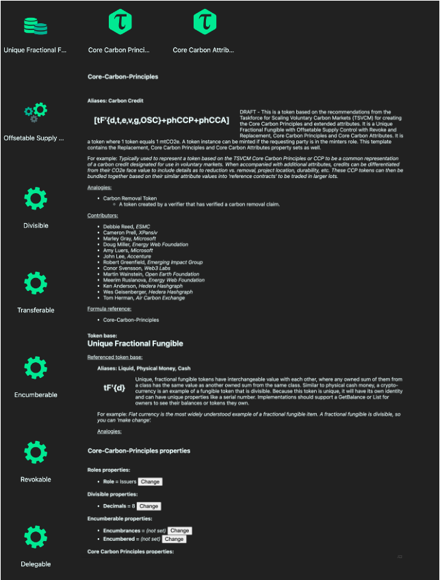

# Core Carbon Principles (CCP) Token

A Core Carbon Principles (CCP) token represents a specified volume of metric tons of GHG emissions reduced or removed by a project. The technique for reduction or removal, its measurement and verification methodology is found in the Verification Contract and the issuing standard registry. The CCP is a tradeable digital asset which the market determines price using the associated information found in the related entities on the network.

The CCP has standard data elements the represent the shared view required by the parties in the carbon market from suppliers, buyers, verifiers, registries and exchanges and are based off of the recommendations from the [TSVCM](https://www.iif.com/tsvcm).

Every CCP will have the following:

- Unique identifier (Id): that is assigned when issued.
- Owner: has Id of the account that is the owner of the token.
- Issuer: the Id for the issuing standard registry.
- Core Carbon Principles (CCP): a set of properties that every CCP will have
- Core Carbon Attributes (CCA): a set of properties where the values can differ significantly between CCPs and allows comparisons and grouping like CCPs together.

Core Carbon Principles contain:

- AssetId: the serial number or unique identifier of the referenced credit on the standard registry that the token represents.
- Issuance Date: the date of creation.
- Generation Type:
- Verification Standard: VCS, GS, etc.
- Additionality:
  - Some Value
- Leakage:
  - Some Value
- Reference to Project/MBP/Claim
- Reference to Contract/VerifiedClaims/Claim
- Date Range: the verified time period of the benefit claim

Core Carbon Attributes contain:

- Classification:
  - Category: Reduction | Removal
  - Method: Nature | Technology
- Vintage:
- Storage: Biological | Geological
- Durability: permanence risk score
- Clear Removals:
  - N2O: <=0
  - CH4: <=0
- Co-benefits: one or more from a list
- PA-Compliance:
  - Corresponding Adjustment

**The complete draft of the TTF specification, including its token base and behaviors, for the [Core Carbon Principles token](https://github.com/InterWorkAlliance/TokenTaxonomyFramework/tree/main/artifacts/token-templates/specifications/Core-Carbon-Principles/latest).**

## Using CCP

CCPs can be held for their value or spent to offset reported emissions in either a voluntary or regulated environment. When an owner offsets a CCP, it is applied towards an ESG Goal or other target and is retired or burned and cannot be offset again. [See ESG Scorecard](../emissions/ESG-Scorecard.md)

## Issues with CCP

Narrowing down the list of attributes to cover the majority of demand signal may run into limits when it comes to value variables like:

- Year scale for Global Warming Potential (GWP) for calculating GHG CO2e:
  - 100yr GWP vs. 20yr GWP for methane(CH4) that has greater warming potential in the 20yr vs. 100yr GWP.
