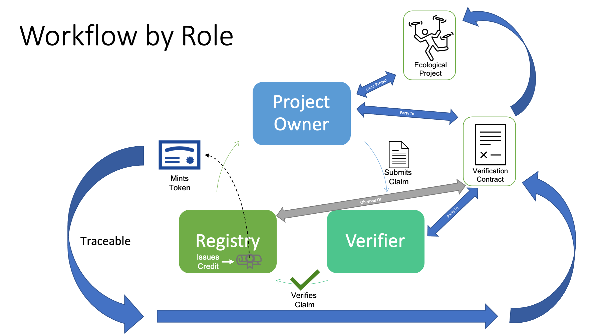

# Lifecycle - Supply of Verified Ecological Credits

The creation of carbon credits, a type of ecological benefit token, is the process of creating verified supply. The verification process should result in the creation of a high quality digital asset, a credit token, whose value can easily be determined and also quickly be compared with other tokens of the same type. However, all of the data needed to verify the integrity and value of the token should not all reside within the token itself, but be available in other data constructs involved in the verification process, such as decentralized identifiers ("DID") and hashes.

## Roles

The process or workflow for creating verified supply involves 3 roles:

- A project owner or developer - this is the entity (person or company) that owns the project whose activities will be the source of benefit claims. These claims are part of a measurement or monitoring, reporting and verification [MRV](mrv.md) process that results in the creation of a credit.
- A VVB - the entity who performs the actions needed to verify the benefit claims issued by a project. Claims and verification should be based on a scientific standard for measuring the results of the activity being conducted by the project.
- A standard registry - the entity that establishes the scientific standard that the claims are based on and the rules for verifying them. A VVB is certified to verify claims against the established standard. Once verified, the registry creates the carbon credit that represents the actual intangible value. This credit becomes the property of the project owner that created the claim.

## Process or MRV

Benefit claims are created through measurement, reporting and verification ([MRV](./mrv.md)).

## Tokens

The roles in the supply process use two basic types to record their activities.

### Ecological Project or Program Tokens
[Ecological Project or Program](ep.md) tokens establish identity and properties defining the common understanding of a project that will create ecological benefit claims.

### Ecological Benefit Tokens
Ecological Benefit Tokens can further be sub-divided into:

#### [Core Carbon Principles](ccp.md)

The token that references the verified benefit credit, reduction, or removal which is recorded in a registry and issued to the project owner.

#### [Carbon Removal Unit](cru.md)

The token that references the verified Carbon Removal Unit credit recorded in a registry that is issued to the project owner.

## Contracts

The relationship between the ecological project, VVB, and registry is established in a [Verification Contract](verification.md). The contract establishes the terms and conditions for the submission of ecological benefit claims by the project to the VVB, the standard used, and the issuance of tokens after a successful verification process.